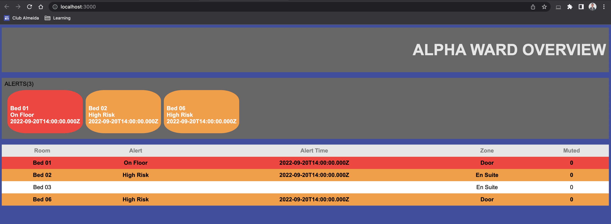

# Real Time Message Application using Socket.io and MongoDB Change Streams

This Application was built to demonstrate the capability of using Websockets with MongoDB Change Streams.


There is a React Client, Node Server and MongoDB instance.

## PreRequisite

You must have a MongoDB instance running either locally or via Cloud Atlas which supports Change Streams.

The instance must have a collection called `Message` as the changes stream is configured for this name.

You will then need a `.env` file in the `server` directory with the URL for this instance like so:

```
MONGODB_URL='mongodb+srv://${username}:${password}@${cluster}.06ovkf2.mongodb.net/${database}?retryWrites=true&w=majority'
```

## Getting Started

### Starting the Server

One you have a MongoDB instance running you can run the Node Server from within the `server` directory as follows:

```
npm start
```

You should be able to see the following terminal output:

```
Database connected successfully
Listening on http://localhost:8080...
```

### Starting the Client

You can then run the React App from within the `client` directory as follows:

```
npm start
```

And again in the `server` terminal you should now see: 

```
Database connected successfully
Listening on http://localhost:8080...
Client connected...
```

You can now visit http://localhost:3000 and the React App should be running.

### Adding Messages

Now that the Client, Server and MongoDB instance are all connected we can start making some changes.

Use your preffered way to add a Mongo document with the following structure to the `Message` collection:

```
{
    "room" : "Bed 01",
    "alert" : "On Floor",
    "alertTime" : "2022-09-20T14:00:00.000+00:00",
    "zone" : "Door",
    "muted" : "0",
}
```

You should now see the message displaying on the React App like so:



You can change the styling of the alert based on the `alert` attribute. It currently supports `On Floor`, `High Risk` otherwise it will default to no style.


